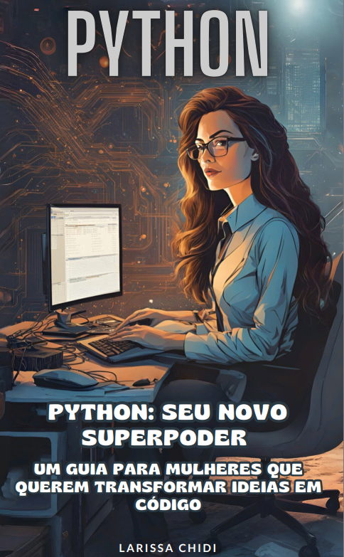

# Projeto EBOOK Gerado por I.A.s

 > ℹ️ **NOTE:** Este é o repositório desenvolvido durante o curso no qual fui aluna na plataforma da [DIO] em parceria da CAIXA e Microsoft (https://dio.me)
    
#CAIXA - IA Generativa com Microsoft Copilot

Projeto com o objetivo de gerar um ebook digital com as facilidades das ferramentas de IA. todos os prompts
seguem abaixo.

<a href="https://github.com/Larachi11/ebook-python-seu-novo-superpoder/blob/main/output/Python%20Seu%20Novo%20Superpoder%20-%20Um%20Guia%20para%20Mulheres%20que%20Querem%20Transformar%20Ideias%20em%20C%C3%B3digo.pdf" title="View PDF now"> 📕Clique aqui para ler</a>

## 💻 Tecnologias utilizadas no projeto

- [ChatGPT](https://chat.openai.com/) 
- [Canva] (https://www.canva.com/)

## 🧠 Prompts

ChatGPT：

|   Ação   | prompt                                                                                                                                                                                                                                                                         |
| :------: | ------------------------------------------------------------------------------------------------------------------------------------------------------------------------------------------------------------------------------------------------------------------------------ |
|  título  | Crie um título de um ebook sobre o tema de python para iniciantes, o ebook é para mulheres que estão se interessando pelo mundo da programação, me liste 5 variações de títulos                                                                                                     |
| conteúdo | Faça um texto para ebook , com foco em python, listando os principais conteúdos com exemplos em código {REGRAS} Explique sempre de uma maneira simples Deixe o texto enxuto, Sempre traga exemplos de código em contextos reais, sempre deixe um título sugestivo por tópico |

Canva：

|  Ação  | prompt                                                                                 |
| :----: | -------------------------------------------------------------------------------------- |
| título | Uma mulher programando em seu computador. Mulheres super poderosas em uma mundo tecnológico|

## ✨ Features

- Conteúdo gerado via ChatGPT
- Imagens geradas via Canva

## 📚 Materiais

- Imagens utilizadas em `assets`
- ebook gerado durante as aulas em `output`

por #Larissa Chidi
